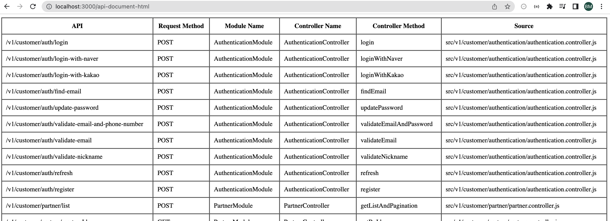
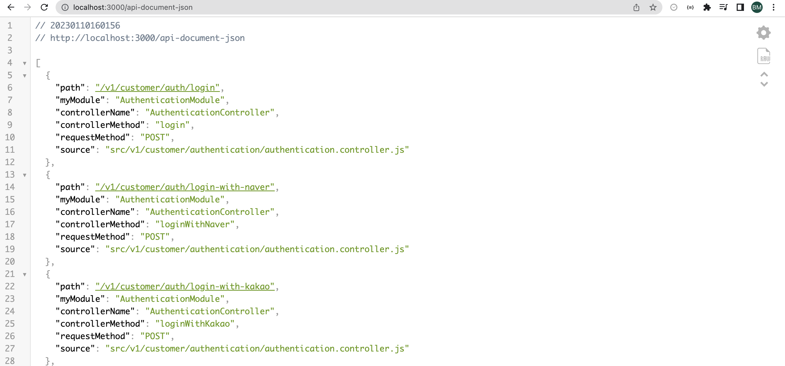

# BRICKMATE GROUP - API MAPPER

## Description

> This package is write for help developer generate api mapper in table format.
> 
> It is use for develop environment only and use with NestJS only.
> 
> When you update source code, it will generate instantly.
> 
> Developer can copy result and paste to notion.


## Requirements

> NestJS<br>
> Webpack disable in nest-cli.json
```
  {
    ...
    "compilerOptions": {
      "webpack": false
    }
  }
```

## How to use

1. Install package
```bash
npm install @brickmate/api-mapper
```

2. Emplement
  File `src/main.ts`

```javascript
await BMGApiMapper.scanApi(app);
```
3. Get report in table format

```
http://localhost:3000/api-document-html
```


1. Get detail in JSON

```
http://localhost:3000/api-document-json
```


## Author
```Jack Tran BMG```

